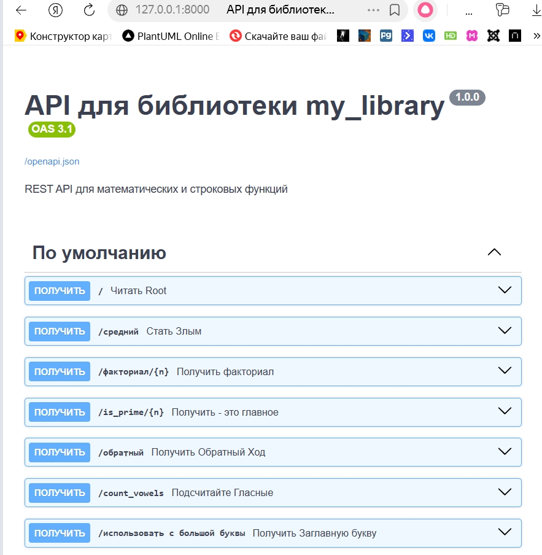
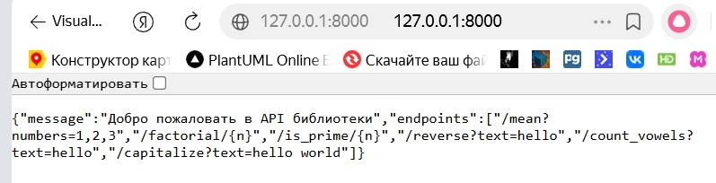

# Отчёт по лабораторной работе №7

**Дисциплина:** Разработка инструментального программного обеспечения  
**Тема:** Настройка CI/CD для автоматической сборки и тестирования библиотеки  
**Выполнил:** Печинин Тихомир Олегович  
**Группа:** 222  
**Дата:** 06.04.2026  


## 1. Цель работы

Научиться настраивать систему непрерывной интеграции и доставки (CI/CD) для автоматизации процессов сборки, тестирования и публикации инструментальной библиотеки.


## 2. Задачи работы

- Подготовить проект с библиотекой и тестами
- Загрузить проект в удалённый репозиторий GitHub
- Настроить автоматическую сборку и запуск тестов при каждом коммите
- Проверить работу CI/CD-пайплайна
- Оформить результаты в виде отчёта


## 3. Выполненные операции

### 3.1 Подготовка проекта

Для работы был взят проект из лабораторной работы №6, содержащий библиотеку `my_library` с шестью функциями и набор тестов pytest.

**Структура проекта:**
```
Lab7/
├── my_library/
│   ├── __init__.py
│   ├── math_utils.py
│   └── string_utils.py
├── tests/
│   ├── __init__.py
│   ├── test_math_utils.py
│   └── test_string_utils.py
├── .github/workflows/
│   └── ci.yml
├── requirements.txt
├── .gitignore
└── README.md
```

### 3.2 Создание репозитория на GitHub

Был создан репозиторий `Lab7` по адресу: `https://github.com/TikhomirPechinin/Lab7`

### 3.3 Настройка GitHub Actions

Создан файл `.github/workflows/ci.yml` с конфигурацией CI/CD пайплайна.

**Содержимое файла `ci.yml`:**
```yaml
name: CI Pipeline

on:
  push:
    branches: [ master, main ]

jobs:
  test:
    runs-on: ubuntu-latest
    
    steps:
    - name: Checkout code
      uses: actions/checkout@v4
    
    - name: Set up Python
      uses: actions/setup-python@v5
      with:
        python-version: '3.11'
    
    - name: Install dependencies
      run: |
        python -m pip install --upgrade pip
        pip install -r requirements.txt
    
    - name: Run tests
      run: |
        python -m pytest tests/ -v
```

**Что делает пайплайн:**
- Запускается автоматически при каждом push в ветки `master` или `main`
- Загружает код из репозитория
- Устанавливает Python версии 3.11
- Устанавливает зависимости из `requirements.txt` (pytest, pytest-cov)
- Запускает все тесты с выводом подробного отчёта

### 3.4 Запуск пайплайна

После отправки кода на GitHub Actions автоматически запустил выполнение всех этапов.

**Скриншот успешного выполнения пайплайна:** *

**Скриншот логов выполнения:** 


### 3.5 Проверка автоматического запуска

При последующем изменении кода (добавлении комментария в README) пайплайн запустился автоматически без ручного вмешательства и успешно прошёл.

**Скриншот истории запусков:** *[вставьте `actions_history.png`]*


## 4. Выводы

### Какие преимущества даёт автоматизация?

- **Автоматический запуск тестов** — после каждого изменения код проверяется автоматически
- **Быстрое обнаружение ошибок** — проблема находится сразу, а не перед релизом
- **Экономия времени** — разработчик не тратит время на ручной запуск тестов
- **История проверок** — все запуски сохраняются, можно отследить, когда что сломалось

### Почему важно использовать CI/CD при разработке ИПО?

- **Качество кода** — автоматическая проверка гарантирует, что новые изменения не сломают существующий функционал
- **Надёжность** — снижается риск попадания ошибок в готовый продукт
- **Скорость разработки** — не нужно каждый раз вручную запускать тесты
- **Командная работа** — все изменения проверяются одинаково, независимо от того, кто их сделал

### Как можно улучшить систему в будущем?

- Добавить автоматическую публикацию библиотеки на PyPI при создании тега (release)
- Добавить проверку стиля кода (flake8, black, pylint)
- Добавить автоматическое создание документации с помощью Sphinx
- Добавить отправку уведомлений в Telegram о результатах запуска
- Настроить кэширование зависимостей для ускорения сборки


## 5. Заключение

Лабораторная работа выполнена в полном объёме. Настроен CI/CD пайплайн с использованием GitHub Actions. При каждом push в репозиторий автоматически запускаются тесты, что позволяет быстро обнаруживать ошибки и поддерживать качество кода на высоком уровне.

