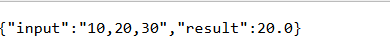
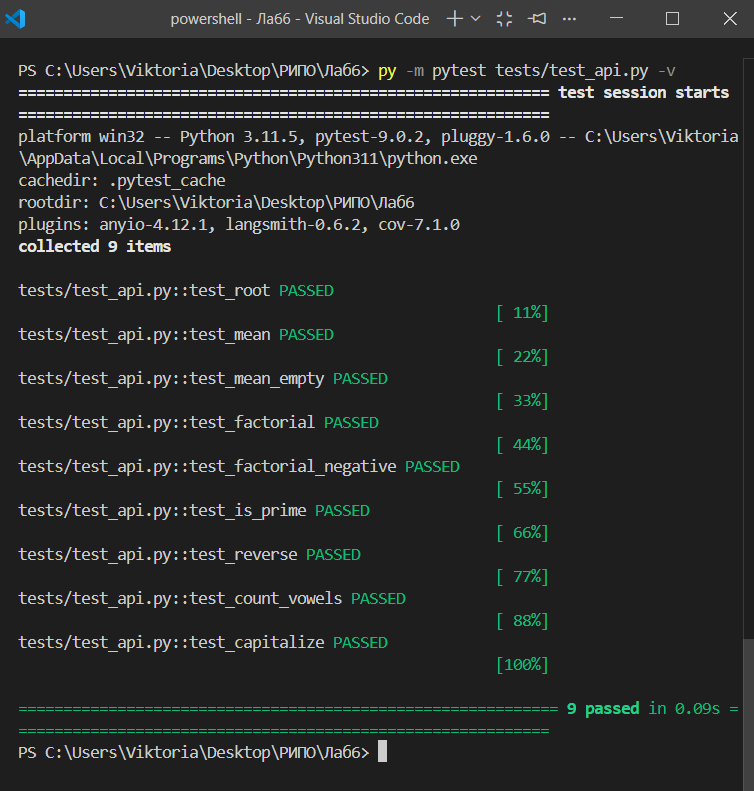

# Отчёт по лабораторной работе №6

**Дисциплина:** Разработка инструментального программного обеспечения  
**Тема:** Создание REST API для библиотеки с использованием FastAPI  
**Выполнил:** Печинин Тихомир Олегович  
**Группа:** 222  
**Дата:** 06.04.2026  


## 1. Цель работы

Научиться создавать веб-интерфейс (REST API) для ранее разработанной библиотеки, чтобы сделать её функционал доступным через HTTP-запросы. Получить практические навыки построения серверных приложений.


## 2. Задачи работы

- Взять библиотеку, созданную в лабораторной работе №3
- Разработать интерфейс API для доступа к её функциям через HTTP
- Реализовать веб-сервис с использованием FastAPI
- Протестировать работу API с помощью браузера и Swagger UI
- Оформить результаты в виде отчёта


## 3. Выполненные операции

### 3.1 Выбор технологии

Для реализации REST API был выбран **FastAPI** — современный фреймворк для Python. Он обеспечивает высокую производительность, автоматическую генерацию документации (Swagger UI) и простоту написания кода.

### 3.2 Структура проекта

```
Лаб6/
│
├── my_library/
│   ├── __init__.py
│   ├── math_utils.py
│   └── string_utils.py
│
├── app/
│   └── main.py
│
├── tests/
│   └── test_api.py
│
├── requirements.txt
└── README.md
```

### 3.3 Библиотека для API

Использована библиотека из лабораторной работы №3, содержащая шесть функций.

**Математические функции:** `calculate_mean` (среднее арифметическое), `factorial` (факториал числа), `is_prime` (проверка числа на простоту)

**Строковые функции:** `reverse_string` (переворот строки), `count_vowels` (подсчёт гласных букв), `capitalize_words` (преобразование первой буквы каждого слова в заглавную)

### 3.4 Реализованные эндпоинты API

Всего создано 7 эндпоинтов.

**Корневой эндпоинт `/`** — возвращает приветственное сообщение и список доступных эндпоинтов.

**Эндпоинт `/mean`** — принимает параметр `numbers` (список чисел через запятую) и возвращает среднее арифметическое.

**Эндпоинт `/factorial/{n}`** — принимает число и возвращает его факториал.

**Эндпоинт `/is_prime/{n}`** — принимает число и возвращает `true` или `false` в зависимости от того, является ли число простым.

**Эндпоинт `/reverse`** — принимает параметр `text` и возвращает перевёрнутую строку.

**Эндпоинт `/count_vowels`** — принимает параметр `text` и возвращает количество гласных букв.

**Эндпоинт `/capitalize`** — принимает параметр `text` и возвращает строку, где каждое слово начинается с заглавной буквы.

### 3.5 Запуск сервера

Сервер запускался командой:
```
py -m uvicorn app.main:app --reload
```

После запуска сервер стал доступен по адресу: `http://127.0.0.1:8000`


### 3.6 Тестирование API

**Тестирование через браузер**

Пример запроса к эндпоинту `/mean`:
`http://127.0.0.1:8000/mean?numbers=10,20,30`

Ответ сервера:
```json
{
  "input": "10,20,30",
  "result": 20.0
}
```



**Автоматическая документация Swagger UI**

FastAPI автоматически сгенерировал документацию по адресу: `http://127.0.0.1:8000/docs`

На этой странице можно увидеть все эндпоинты, их описание, а также выполнить тестовые запросы прямо из браузера.

*

**Тестирование через pytest**

Для API были написаны автоматические тесты. Запуск тестов выполнялся командой:
```
py -m pytest tests/test_api.py -v
```

Результат: все 9 тестов пройдены успешно.




## 4. Примеры запросов и ответов

**Запрос:** `/factorial/5`  
**Ответ:** `{"input": 5, "result": 120}`

**Запрос:** `/is_prime/17`  
**Ответ:** `{"input": 17, "result": true}`

**Запрос:** `/reverse?text=hello`  
**Ответ:** `{"input": "hello", "result": "olleh"}`

**Запрос:** `/count_vowels?text=hello`  
**Ответ:** `{"input": "hello", "result": 2}`

**Запрос:** `/capitalize?text=hello world`  
**Ответ:** `{"input": "hello world", "result": "Hello World"}`


## 5. Выводы

**Какие преимущества даёт создание API поверх библиотеки?**

- Функционал библиотеки становится доступен из любого языка программирования и с любой платформы через HTTP
- Библиотека превращается в микросервис, который можно развернуть на отдельном сервере
- API легко интегрируется с веб-приложениями, мобильными приложениями и другими сервисами

**Почему важно правильно проектировать API?**

- Понятная и полная документация упрощает использование API другими разработчиками
- Единообразие эндпоинтов (например, все GET-запросы) снижает вероятность ошибок
- Корректная обработка ошибок и понятные сообщения повышают надёжность сервиса

**Как можно улучшить API в будущем?**

- Добавить POST-запросы для передачи сложных структур данных
- Добавить аутентификацию и авторизацию (API-ключи или JWT)
- Добавить ограничение частоты запросов (rate limiting)
- Контейнеризировать приложение с помощью Docker для удобного развёртывания
- Написать более подробную документацию с примерами на всех языках

## 6. Заключение

Лабораторная работа выполнена в полном объёме. На основе библиотеки из ЛР3 создан REST API с семью эндпоинтами. Сервер реализован на FastAPI, протестирован через браузер, Swagger UI и автоматические тесты. Полученные навыки позволяют в дальнейшем создавать веб-сервисы и микросервисную архитектуру на Python.
